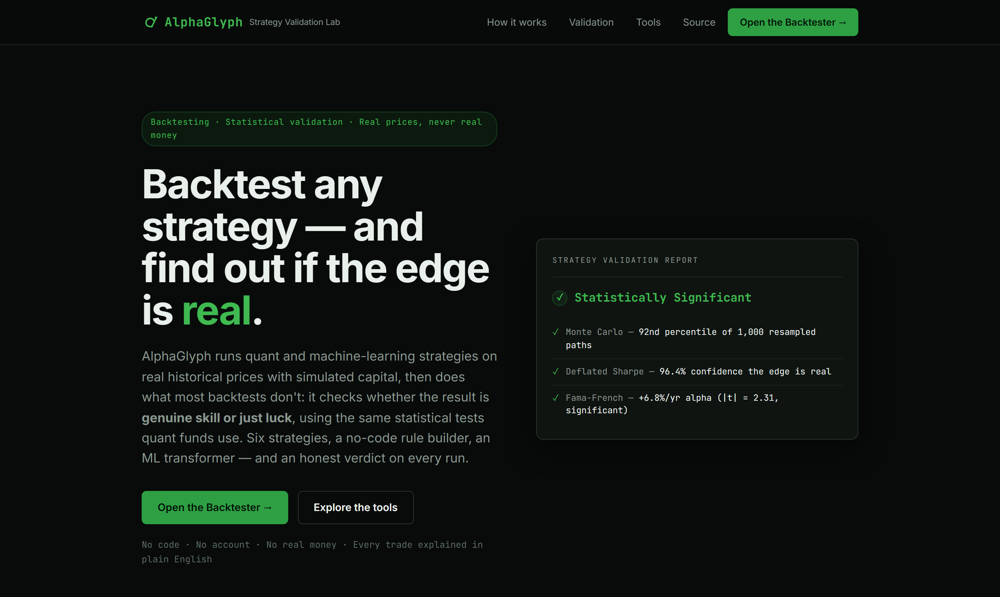
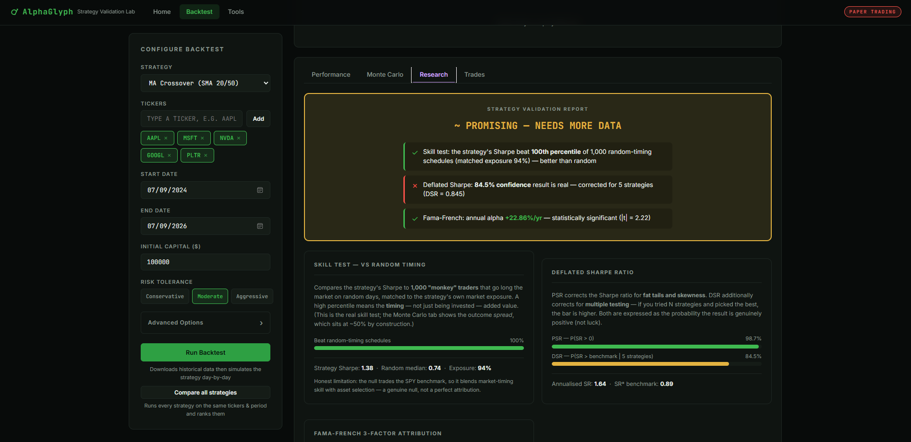
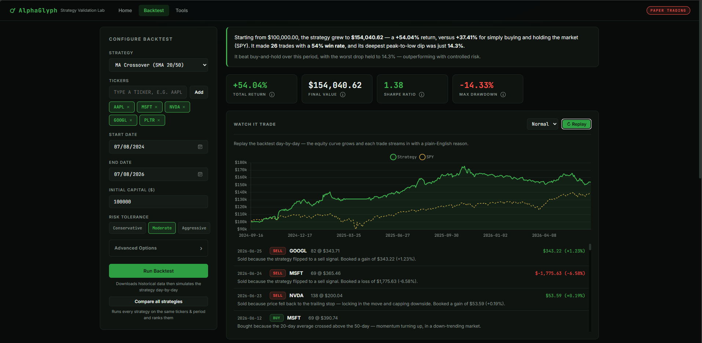
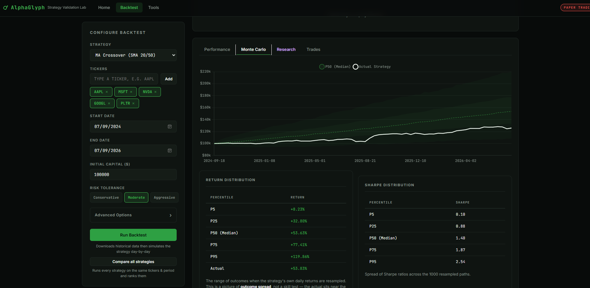
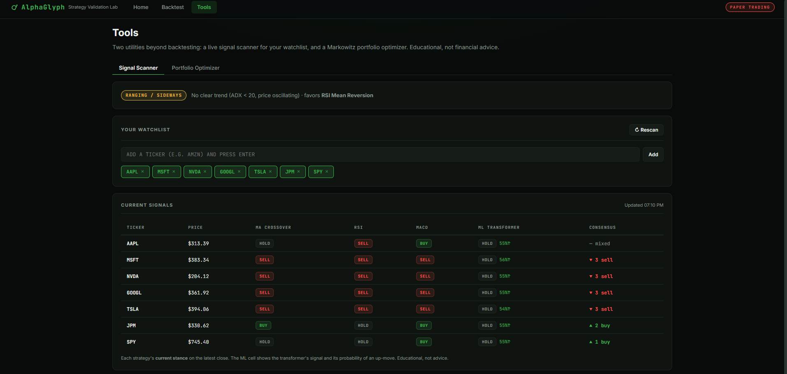
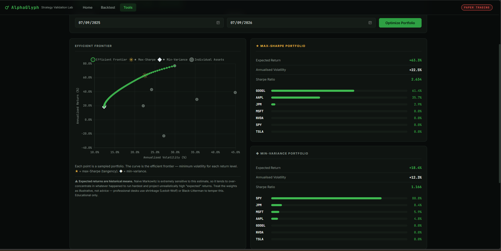
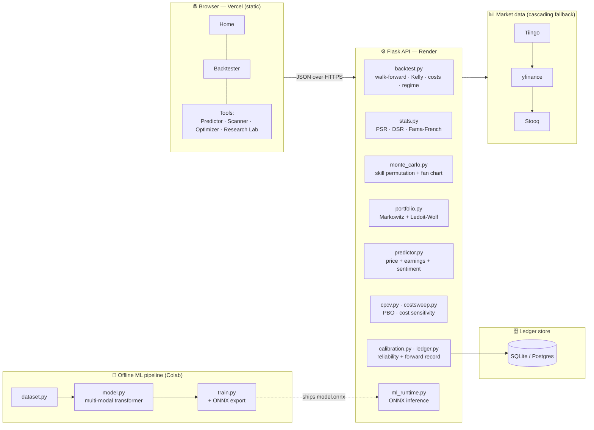

<div align="center">

<a href="https://alphaglyph.org"></a>

<p>
  <a href="https://github.com/Danny-397/Alphaglyph/actions/workflows/ci.yml"></a>
  <a href="https://alphaglyph.org"></a>
  
  
  
  
  <br>
  
  
  
  
  
  
</p>

<strong>Backtest any trading strategy on real historical prices, then do what almost no student project does &mdash; run the same statistical tests institutional quant funds use to decide whether the edge is genuine skill or just luck.</strong>

<br><br>

<a href="https://alphaglyph.org"><b>Live demo</b></a> &nbsp;&middot;&nbsp;
<a href="#the-thesis-is-the-edge-real"><b>The thesis</b></a> &nbsp;&middot;&nbsp;
<a href="#does-the-edge-survive-scrutiny"><b>Evidence</b></a> &nbsp;&middot;&nbsp;
<a href="#feature-overview"><b>Features</b></a> &nbsp;&middot;&nbsp;
<a href="#api-reference"><b>API</b></a> &nbsp;&middot;&nbsp;
<a href="#methodology--honest-limitations"><b>Honest limits</b></a>

</div>

AlphaGlyph is a full-stack **backtesting & strategy-validation lab**. Run classical
quant strategies, a patient "dip-buyer," build-your-own-rule custom strategies, or a
multi-modal machine-learning transformer on real historical prices with simulated
capital — every trade explained in plain English — then subject the result to a
battery of tests designed to *disprove* it: a random-timing permutation test, the
Deflated Sharpe Ratio, Fama-French factor attribution, a live **Probability of
Backtest Overfitting**, a transaction-cost sensitivity sweep, and an append-only
**forward track record** that grades predictions after the fact.

<p align="center">
  <a href="https://alphaglyph.org"></a>
</p>

> ⚠️ **Disclaimer — educational, simulated only.** AlphaGlyph backtests strategies at
> **real historical market prices** with **simulated capital**. There is no brokerage
> account, no API keys, and **no real money is ever involved.** Nothing here is
> financial advice, and past backtested performance does not predict future results.

---

## The thesis: *is the edge real?*

I started out wanting to build a bot that beat the market. I got one — on the
backtest. Then I changed the date range and it lost. Then I added a second strategy,
kept the better of the two, and got an even nicer number. That was the moment the
project got interesting: I had built a machine for **fooling myself**, and almost
every "my strategy returns 40%" project is doing exactly that without noticing.

So the real engineering here isn't the prediction — it's the **epistemics**: building
the instruments that tell you when you're wrong, and being honest when they succeed.
The ML model lands at roughly a coin flip (test AUC ≈ 0.51), and that number is in
this README on purpose. A project about statistical honesty that hid its worst result
would be a lie.

Every capability below exists to answer one question — *is this edge real, or am I
being fooled?* — from a different angle.

| Layer | Module(s) | The question it answers |
|-------|-----------|-------------------------|
| **1. Simulate** | [`backtest.py`](backend/backtest.py) | What would this strategy have done — with costs, Kelly sizing, walk-forward splits, and no look-ahead? |
| **2. Validate** | [`stats.py`](backend/stats.py), [`monte_carlo.py`](backend/monte_carlo.py) | Is the Sharpe real after correcting for luck, multiple testing, fat tails, and known factor premia? |
| **3. Stress-test** | [`cpcv.py`](backend/cpcv.py), [`costsweep.py`](backend/costsweep.py) | Does the in-sample winner survive out-of-sample, and does the edge survive realistic frictions? |
| **4. Forecast & prove** | [`predictor.py`](backend/predictor.py), [`calibration.py`](backend/calibration.py), [`ledger.py`](backend/ledger.py) | Is the forecaster calibrated on past data — and does it hold up on a live, append-only forward record? |

---

## Does the edge survive scrutiny?

The point of AlphaGlyph is that these numbers are *measured, not asserted* — every
figure below is live output you can reproduce from the app or the API.

### Overfitting probability (CPCV → PBO)

A real trend + mean-reversion **hyperparameter grid** (42 variants) is cross-validated
on SPY using Combinatorially-Symmetric Cross-Validation (Bailey & López de Prado, 2014),
with the seam between splits purged/embargoed so serial correlation can't leak the edge:

| Metric | Result | Reading |
|---|---|---|
| Probability of Backtest Overfitting | **63%** | The in-sample winner lands in the bottom half OOS more often than not |
| Median in-sample Sharpe surviving OOS | **~38%** | Most of the "edge" evaporates the moment you leave the fitting window |
| Chosen strategy loses money OOS | **~1%** | It doesn't blow up — it just isn't special |
| Grid size × CV splits | **42 × 252** | A genuine search, exactly the situation PBO was built to police |

*Takeaway: on a broad-market index, hyperparameter search is essentially picking
noise. The tool says so out loud — reproduce via `POST /api/research/cpcv`.*

### Is the edge just one regime? (regime-conditional performance)

The Dip Buyer on `AAPL, MSFT` (2021–2024), split by the market regime each invested
day fell in, strategy return vs. buy-and-hold **within** that regime:

| Regime | % of time | Strategy | SPY | Excess |
|---|--:|--:|--:|--:|
| Ranging / sideways | 55.8% | +21.8% | +5.6% | **+16.3%** |
| High volatility | 9.8% | −5.8% | −12.8% | **+7.0%** |
| Trending down | 15.9% | +8.1% | +32.2% | −24.1% |
| Trending up | 18.5% | −4.0% | +3.2% | −7.2% |

*Takeaway: the Dip Buyer's edge lives almost entirely in ranging markets and it defends
capital in high-vol — but it gives ground in trends. A strategy whose whole edge lives
in one regime is far more fragile than one that beats the benchmark across several, and
this table makes that legible instead of hiding it in a single blended Sharpe.*

### Is the forecaster honest? (out-of-sample calibration)

The ML price forecaster, scored only on data after its train/val cutoff: a prediction
of "60% up" is worthless unless the market actually rises ~60% of the time it's said.

| Metric | Result | Reading |
|---|---|---|
| Test AUC | **≈ 0.51** | Near a coin flip — next-week direction is genuinely hard, and we say so |
| Brier skill vs. base rate | **≈ 0** | No meaningful edge over always guessing the base rate — honestly reported |
| Out-of-sample predictions scored | **thousands** | Across a liquid universe, gated to post-cutoff data only |

*Takeaway: the value is the **rigour of the evaluation**, not a magic edge. The
**live ledger** ([`ledger.py`](backend/ledger.py)) then takes this forward: it logs
every real prediction the moment it's made and grades it once the horizon elapses, so
the forward hit rate can't be fitted in hindsight.*

---

## Feature overview

### Predictor (multi-signal, fully transparent)
A forward lean for the next few trading days on any ticker, blended from three
independent, individually-explained channels — **not** a black box:
- **Price / technical** — the ML transformer's probability-of-up-move and its q10–q90
  return distribution (degrades to a transparent momentum read if the model is offline).
- **Earnings** — post-earnings-announcement drift (PEAD) + YoY EPS growth.
- **News sentiment** — GDELT news tone and its recent momentum.

Each channel emits a score in [−1, +1] and a confidence in [0, 1]; the blend weights
each by **(prior × confidence)**, renormalised over whatever's available, and channel
**disagreement lowers** the combined confidence. Every number on the card traces back
to a component you can see, and it never claims better than "moderate" confidence
because this is still a near-coin-flip domain.

### Research Lab (the "am I fooling myself?" toolkit)
- **Post-Earnings Drift (PEAD) event study** — pools every earnings event across a
  basket, plots the average market-adjusted cumulative return by surprise tercile, and
  runs a beat-minus-miss t-test. Honest by construction: if free data can't prove it,
  the verdict says so.
- **Data-Mining Lab** — generates hundreds of *purely random* timing strategies, keeps
  the luckiest, and shows the trap: naive statistics call it significant, the Deflated
  Sharpe deflates it back to noise.
- **CPCV + PBO** — Combinatorially-Symmetric Cross-Validation over a real
  hyperparameter grid → the Probability of Backtest Overfitting, with a λ-histogram,
  an in-sample-vs-out-of-sample Sharpe scatter, and the purged split-structure grid.
- **Cost sensitivity** — reruns a strategy across a 0→100 bp/side cost grid and solves
  for the break-even cost at which its edge over buy-and-hold vanishes. An edge that
  dies at 5 bp is a frictionless artefact; one that survives 50 bp is believable.

### Live forward ledger (the forward test)
An **append-only**, time-stamped track record. Every prediction is logged the moment
it's made (ticker, probability, price, horizon) and **lazily graded** once its horizon
elapses — nothing is ever edited after the fact. This is the honest counterpart to
calibration: calibration measures the model on historical out-of-sample data; the
ledger measures it on the *future*, one real day at a time. Persists to SQLite locally
or Postgres in production (see [Honest limits](#methodology--honest-limitations)).

### Strategies (6 + adaptive + custom)
- **MA Crossover** — trend stance with a 1% hysteresis band (dead band kills whipsaw churn).
- **RSI Mean Reversion** — buy oversold dips *only within an uptrend*; no falling knives.
- **MACD Momentum** — long while the MACD line is above zero (far less churn than the signal-line cross).
- **Dip Buyer (52-week value)** — buys more as price falls toward its 52-week low, averages down, keeps dry powder, sells on recovery.
- **ML Transformer** — multi-modal architecture (price + macro + news blocks with modality dropout), served via ONNX. *Honest note: the shipped checkpoint was trained with macro/news zero-filled, so it currently predicts from price alone — the plumbing is real and tested; a retrain activates the extra channels with no code change.*
- **Custom (no-code rule builder)** — BUY/SELL from indicators (price, SMAs, RSI, MACD, volume, returns, 52-week range) with below / above / crosses-above / crosses-below, combined with ALL/ANY.
- **Adaptive Mode** — detects the current SPY regime and auto-selects the fitting strategy.

### Statistical validation (after every backtest)
- **Skill test vs. random timing** — 1,000 "monkey" traders long the benchmark on a random subset of days, matched to the strategy's exposure; the real "beats random?" test (a bootstrap of a strategy's *own* returns sits at ~the 50th percentile by construction and can't separate skill from luck).
- **Monte Carlo fan chart** — 1,000 stationary block-bootstrap paths (Politis & Romano, 1994); labelled as an outcome-*spread* view, **not** a skill test.
- **Probabilistic & Deflated Sharpe Ratio** (López de Prado, 2014) — corrects for non-normality, finite samples, and multiple-testing bias.
- **Fama-French 3-factor decomposition** — separates genuine alpha from passive size/value/market exposure a factor ETF would give for free.

### Portfolio Optimizer
- **Markowitz efficient frontier** via `scipy.optimize` (SLSQP): max-Sharpe (tangency) and global min-variance portfolios, asset scatter, and a correlation heatmap.
- **Ledoit-Wolf shrinkage** (optional) — pulls the noisy sample covariance toward a scaled-identity target by the analytically optimal amount; the professional fix for naive-Markowitz over-concentration. Reports the shrinkage intensity δ and the resulting weight concentration (HHI).
- **Honest caveat (shown in the UI):** expected returns are historical means, so plain Markowitz is hypersensitive to that estimate — turn shrinkage on and watch the weights spread out.

### Market regime detection
Classifies the market into four states from SPY using **ADX** (Wilder), **Bollinger
Band Width**, and **30-day realized volatility**:

| Regime | Trigger | Default strategy |
|---|---|---|
| Trending Up | ADX ≥ 25, +DI > −DI | MA Crossover |
| Trending Down | ADX ≥ 25, −DI > +DI | MA Crossover |
| Ranging | ADX < 20 | RSI Mean Reversion |
| High Volatility | 30-day realized vol > 25% | RSI (reduced size) |

### Backtesting engine
Day-by-day simulation over any date range and ticker set, with **walk-forward
cross-validation** (train 70% / evaluate 30%), configurable **transaction costs**,
**rolling Kelly sizing** (no look-ahead), **regime tagging** on every trade, a **SPY
benchmark**, and a **client-side animated replay** of every explained trade.

---

## What makes this different

| Typical student trading project | AlphaGlyph |
|---|---|
| "My Sharpe is 1.4" | "My Sharpe is 1.4, the Deflated Sharpe gives 91% it's real after 5 strategies, and the **PBO says the search that found it overfits 63% of the time**" |
| Backtest and stop | After the backtest: skill test, DSR, Fama-French, CPCV/PBO, and a cost-sensitivity sweep |
| Return metric only | Fama-French alpha decomposition — skill vs. passive factor exposure |
| One blended Sharpe | **Regime-conditional** performance — is the edge real, or just one lucky regime? |
| Backtest = truth | A live **append-only forward ledger** that grades predictions after the fact |
| Fixed stop / fixed sizing | Trailing stop + rolling Kelly Criterion sizing |
| Black-box decisions | Every trade explained in plain English (what it saw, the regime, why it acted) |
| Naive Markowitz | Efficient frontier **+ Ledoit-Wolf shrinkage** with an honest caveat |
| No cost realism | Costs on every fill **+** a sweep showing the break-even cost where the edge dies |

---

## Screenshots

The fastest way to see it is the **[live demo → alphaglyph.org](https://alphaglyph.org)**.

| Backtest — equity curve vs SPY, every trade explained | Monte Carlo outcome-spread fan chart |
|---|---|
|  |  |

| Signal Scanner — every strategy's stance (ML honestly near a coin flip) | Portfolio Optimizer — efficient frontier + naive-mean caveat |
|---|---|
|  |  |

---

## Architecture

A deliberately simple design: the browser holds all UI state, the backend is a
compute layer (each request is a self-contained market computation), and the ML model
is trained **offline** and shipped as a portable ONNX artifact — so the live server
never trains and survives a free-tier cold start with nothing to recover. The one
piece of server-side state is the **forward ledger**, which persists to SQLite/Postgres;
everything else runs statelessly.



---

## API reference

The core endpoints are **stateless** pure computations; only the ledger touches a
store. All are per-IP rate-limited.

| Endpoint | Method | Description |
|---|---|---|
| `/api/backtest` | POST | Full backtest — walk-forward, Kelly, costs, skill test, Monte Carlo, DSR, Fama-French, **regime-conditional** breakdown |
| `/api/compare` | POST | Run every strategy on the same inputs → ranked leaderboard |
| `/api/predict` | GET | Multi-signal Predictor (price + earnings + sentiment); also logs the call to the forward ledger |
| `/api/predict/calibration` | GET | Out-of-sample reliability of the ML forecaster (reliability diagram + Brier/skill scores) |
| `/api/predict/ledger` | GET | The live append-only forward track record (lazily grades matured rows) |
| `/api/research/pead` | GET | Pooled post-earnings-drift event study with a beat-minus-miss t-test |
| `/api/research/datamine` | POST | Random-strategy sweep → Deflated Sharpe deflation (p-hacking demo) |
| `/api/research/cpcv` | POST | Combinatorial Purged CV → Probability of Backtest Overfitting |
| `/api/research/cost-sensitivity` | POST | Cost-sweep: net-return decay + break-even cost vs. buy-and-hold |
| `/api/scan` | GET | Live Signal Scanner: current stance of every strategy + ML per ticker |
| `/api/regime` | GET | Detect the current market regime from live SPY data |
| `/api/portfolio/optimize` | POST | Markowitz efficient frontier (optional Ledoit-Wolf shrinkage) |
| `/api/ml/info` | GET | ML model status, architecture, train/val/test metrics, thresholds |
| `/api/validate_ticker` | GET | Check whether a ticker symbol exists |
| `/health` | GET | Health check (`{"status": "ok", "ml": "loaded"}`) |

<details>
<summary><b>Backtest request body</b></summary>

```json
{
  "strategy":        "dip_buyer",
  "tickers":         ["AAPL", "MSFT", "NVDA", "GOOGL", "TSLA", "JPM", "SPY"],
  "start_date":      "2023-01-01",
  "end_date":        "2024-01-01",
  "initial_capital": 100000,
  "walk_forward":    false,
  "risk_tolerance":  "moderate",
  "commission_pct":  0.0003,
  "slippage_pct":    0.0003,
  "use_markowitz":   false,
  "range_sizing":    false,
  "custom_rules":    null
}
```

For `"strategy": "custom"`, supply `custom_rules`:

```json
{
  "buy":  {"logic": "all", "conditions": [{"left": "rsi14", "op": "lt", "right": 30}]},
  "sell": {"logic": "any", "conditions": [{"left": "rsi14", "op": "gt", "right": 70}]}
}
```
</details>

---

## Tech stack

**Backend** — Python 3.11 · Flask 3.0 · pandas 2.2 · numpy 1.26 · scipy 1.13 (SLSQP
Markowitz) · onnxruntime 1.19 (ONNX inference) · psycopg2 (Postgres ledger) · gunicorn
22. Market data cascades **Tiingo → yfinance → Stooq**. All indicator maths (SMA, EMA,
RSI, MACD, ADX, Bollinger Bands) is implemented from first principles — no TA-Lib.

**Frontend** — vanilla HTML5 / CSS3 / ES2022 + Chart.js 4.4 (with the annotation
plugin). No React, no build step — open any `.html` in a browser.

**CI/CD** — GitHub Actions: `py_compile` syntax check, flake8 lint, **pytest (169
tests)**, and a DB/simulator smoke test; a non-blocking pip-audit security job.

---

## Project structure

```
alphaglyph/
├── backend/                  (Flask API — stateless core + optional ledger store)
│   ├── app.py           REST API — 15 endpoints
│   ├── strategies.py    Signal generators + current-stance scanner
│   ├── backtest.py      Simulation — walk-forward, Kelly, costs, regime tagging + conditional split
│   ├── predictor.py     Multi-signal Predictor (price + earnings + sentiment blend)
│   ├── earnings.py      PEAD + YoY EPS-growth signal
│   ├── calibration.py   Out-of-sample reliability of the ML forecaster
│   ├── ledger.py        Append-only forward prediction record + lazy grading
│   ├── cpcv.py          Combinatorial Purged CV → Probability of Backtest Overfitting
│   ├── costsweep.py     Transaction-cost sensitivity sweep + break-even solver
│   ├── pead.py          Pooled post-earnings-drift event study
│   ├── datamining.py    Random-strategy sweep (p-hacking demo)
│   ├── portfolio.py     Markowitz efficient frontier + Ledoit-Wolf shrinkage (SciPy SLSQP)
│   ├── monte_carlo.py   Random-timing skill test + stationary block-bootstrap fan chart
│   ├── stats.py         PSR, Deflated Sharpe Ratio, Fama-French 3-factor OLS
│   ├── regime.py        Regime detection (ADX, BB Width, realized vol)
│   ├── ml_runtime.py    ONNX inference (lazy load, graceful degrade)
│   ├── ml_features.py   Multi-modal feature frames (price + macro + news)
│   ├── features.py      Indicator engineering — from scratch
│   ├── risk.py          Risk profiles: trailing stop, Kelly caps, daily limits
│   ├── database.py      SQLite/Postgres layer (backs the ledger)
│   └── tests/           169 tests, fully offline
├── ml/                       (offline training — Colab, not on the server)
│   ├── dataset.py · model.py · train.py   (12y dataset · transformer · ONNX export)
├── frontend/                 (vanilla HTML/CSS/JS + Chart.js — green dark theme)
│   ├── index.html · backtest.html · tools.html
│   └── landing.css · style.css · config.js · app.js
├── .github/workflows/   ci.yml · keepwarm.yml
└── render.yaml · .flake8 · .env.example · README.md
```

---

## Setup

```bash
# 1) Clone
git clone https://github.com/Danny-397/Alphaglyph && cd Alphaglyph

# 2) Install backend deps
pip install -r backend/requirements.txt

# 3) Run the API (no keys required; creates the ledger table automatically)
python backend/app.py                      # → http://localhost:5000  (health: /health)

# 4) Serve the frontend (any static server avoids CORS issues)
python -m http.server 3000 -d frontend     # → http://localhost:3000

# 5) Run the tests (fully offline, deterministic)
cd backend && pytest -q                    # 169 passing
```

No API keys or brokerage account are needed. A free [Tiingo](https://www.tiingo.com)
key is optional but recommended — yfinance/Stooq are heavily rate-limited from cloud
IPs, while Tiingo's free tier is reliable from anywhere.

### Environment variables (all optional)

| Variable | Purpose |
|---|---|
| `TIINGO_API_KEY` | Primary market-data source (recommended for production) |
| `DATABASE_URL` | Postgres connection string — makes the **forward ledger survive redeploys** (SQLite used if unset) |
| `PORT` | Flask port (default 5000) |
| `CORS_ORIGINS` | Allowed origins (default `*`; set to your Vercel URL in prod) |
| `KEEPALIVE_SECONDS` | Self-ping interval to keep the free Render instance warm (default 600) |

---

## Deployment

- **Backend → Render** — new Web Service, root directory `backend/`, start
  `gunicorn app:app`. `render.yaml` configures it automatically; no persistent disk is
  required to run, but set `DATABASE_URL` (free Neon/Supabase Postgres) if you want the
  ledger to accrue across redeploys.
- **Frontend → Vercel** — root directory `frontend/`, no build step; point
  `frontend/config.js` (`window.RENDER_URL`) at your Render API URL.
- **`workers = 1`** keeps the in-process cache, rate limiter, and keep-warm thread
  coherent; the free instance self-pings `RENDER_EXTERNAL_URL` every ~10 min so it
  stays warm without an external uptime service.

---

## Mathematical background

<details>
<summary><b>Expand the formulas & references</b></summary>

**Kelly Criterion** — `f* = (b·p − q) / b`, `b = avg_win/avg_loss`, `p = win_rate`.
Half-Kelly in practice; falls back to fixed sizing under 10 closed trades.

**Probabilistic Sharpe Ratio** — `PSR(SR*) = Φ[(SR_hat − SR*)√(T−1) / √(1 − γ₃·SR_hat + (γ₄−1)/4·SR_hat²)]`.
Corrects for skewness (γ₃) and kurtosis (γ₄). *López de Prado (2014), "The Deflated Sharpe Ratio."*

**Deflated Sharpe Ratio** — PSR where `SR* = E[max Sharpe | N strategies]`, scaled by
`√(252/T)`. A DSR > 95% means the best of N is unlikely to be the luckiest.

**Probability of Backtest Overfitting (CSCV)** — split T rows into S groups; over every
choice of S/2 as in-sample, pick the best-Sharpe variant, find its OOS rank
ω = rank/(N+1), logit λ = ln(ω/(1−ω)); **PBO = P(λ ≤ 0)**. Purge/embargo the block
seams. *Bailey, Borwein, López de Prado & Zhu (2014).*

**Ledoit-Wolf shrinkage** — `Σ̂ = δ·μI + (1−δ)·S` with the analytically optimal
intensity δ that minimises expected Frobenius loss. *Ledoit & Wolf (2004), "Honey, I
Shrunk the Sample Covariance Matrix."*

**Fama-French 3-factor** — `R_p − R_f = α + β_mkt(R_m−R_f) + β_smb·SMB + β_hml·HML + ε`,
OLS via `numpy.linalg.lstsq`; |t| > 2 ≈ significant. *Fama & French (1993).*

**Markowitz** — `min wᵀΣw` s.t. `Σw = 1, w ≥ 0`; max-Sharpe minimises
`−(wᵀμ − r_f)/√(wᵀΣw)` via SLSQP. *Markowitz (1952).*

**Random-timing permutation test** — 1,000 schedules long the benchmark on a random
`k = round(exposure·T)` days; the statistic is the strategy Sharpe's percentile rank in
that null. Related: *Masters (2018).*

</details>

---

## Methodology & honest limitations

Backtesting is easy to get wrong in ways that flatter the result. Here is what this
engine does — and, just as importantly, what it does **not** claim.

- **The ML model is roughly a coin flip (test AUC ≈ 0.51).** Not a bug to hide —
  next-week direction is close to unpredictable. The value is the rigour of the
  evaluation (chronological 60/20/20 splits, out-of-sample gating, DSR, PBO), not an edge.
- **The shipped model is currently price-only.** The architecture is multi-modal, but
  the committed checkpoint was trained with the macro/news blocks zero-filled (FRED/GDELT
  were unavailable during that run). The macro/news entries in `ml_model_meta.json` have
  mean/std of exactly `0.0` — verify it yourself. A retrain activates them, no code change.
- **The forward ledger resets on redeploy without `DATABASE_URL`.** Without a Postgres
  connection string it lives in ephemeral SQLite and is wiped whenever Render redeploys.
  Set `DATABASE_URL` for the track record to genuinely accumulate over time.
- **No look-ahead** — every signal at day *T* uses only data through *T*; verified by
  `test_backtest.py::TestNoLookahead` (truncating the future must not change a past trade).
  Rolling Kelly uses only trades that closed *before* the current date.
- **"Beats the market" is period-dependent.** Simple technical strategies frequently
  *underperform* buy-and-hold, especially in trends — which is exactly why the skill
  test, DSR, Fama-French, PBO, and cost-sweep exist: to ask whether a result is real.
- **The Monte Carlo fan chart is not a skill test.** A bootstrap of a strategy's own
  returns is centered on its actual result by construction; the random-timing permutation
  test is the one that asks "did this beat random?"
- **The portfolio optimizer is naive Markowitz** (historical-mean returns) unless
  Ledoit-Wolf shrinkage is enabled; weights are illustrative, not advice.
- **Fills are modelled at the daily close** with a flat commission + slippage per side;
  next-open fills, market impact, and partial fills are not modelled. The cost-sensitivity
  sweep exists precisely to show how much the result depends on that assumption.
- **Paper trading only — no real money, not financial advice.** Past backtested
  performance does not predict future returns.

---

## License

[MIT](LICENSE) — free to use, fork, and build on with attribution.

## Author

**Danny** — independent project demonstrating quantitative finance, statistical
inference, machine learning, and full-stack engineering. Concepts implemented from
scratch include Wilder's ADX / RSI / MACD, rolling Kelly sizing, the random-timing
permutation and stationary block-bootstrap tests, Probabilistic & Deflated Sharpe,
Combinatorial Purged CV → PBO, Ledoit-Wolf shrinkage, and Fama-French 3-factor OLS.
</content>
</invoke>
